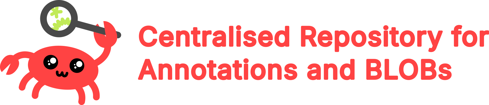

A FOSS stack for ML dataset management and annotation

## Prerequisites

> [!NOTE]
> This repository contains submodules. Make sure to clone with `--recurse-submodules`!

You will need to pre-install Docker Compose and BIIGLE, should you wish to use BIIGLE integrations. Work is ongoing to integrate BIIGLE into this deployment, for now install [BIIGLE](https://biigle-admin-documentation.readthedocs.io/installation/) seperately.

## Installation

For a local install, run `flask/build.sh` first.
Then run `generate-env.sh` to auto-generate a `.env` file.
If you're using externally managed S3 compatible storage, edit the `.env` file now and skip running `init-db.sh`. You'll need to configure databases manually.
Run `init-db.sh` to prepare your databases automatically.
Finally, run `launch.sh` to start your instance.
CRAB should now be avaliable on `http://localhost:8080`

## Configuration

### HTTPS

While normally, a seperate reverse proxy on the host machine would be used, one can enable SSL on the included nginx container. Edit the config template in `templates/nginx.conf` to enable SSL before launching.

## License
CRAB is free software under the AGPL-3.0 license
The CRAB Logo (© 2024, Alex Baldwin) is licensed under CC BY-SA 4.0
