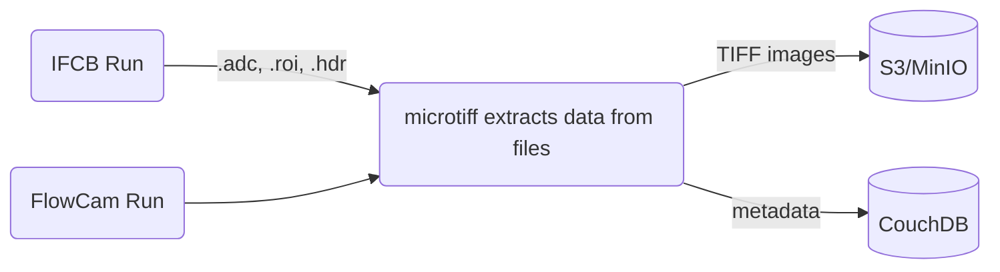
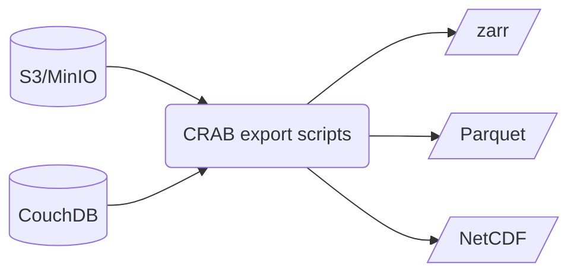

# Data lifecycle for the CRAB system

```mermaid
flowchart LR
    A(IFCB Run) -->|.adc, .roi, .hdr| B(microtiff extracts data from files)
    G(FlowCam Run) --> B
    B -->|TIFF images| s3[(S3/MinIO)]
    B -->|metadata| cdb[(CouchDB)]
```

```mermaid
flowchart LR
    s3[(S3/MinIO)]
    cdb[(CouchDB)]

    exp(CRAB export scripts)

    par@{ shape: lean-r, label: "Parquet"}
    zarr@{ shape: lean-r, label: "zarr"}
    netcdf@{ shape: lean-r, label: "NetCDF"}
    s3 --> exp
    cdb --> exp
    exp --> zarr
    exp --> par
    exp --> netcdf
```
